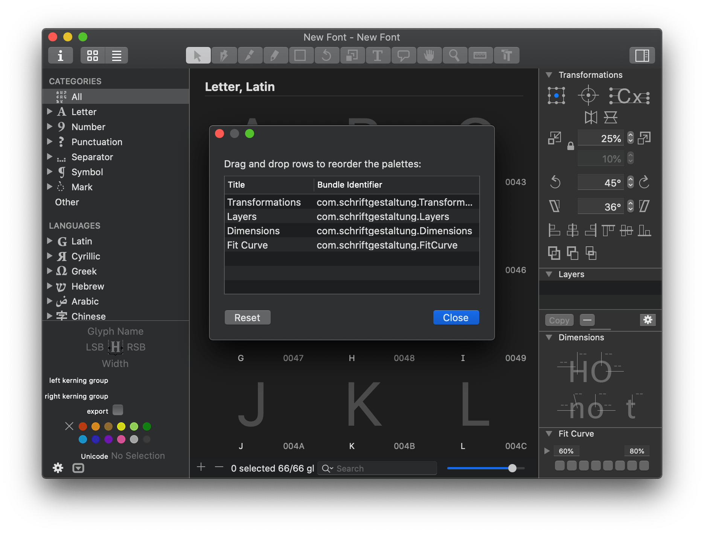

# ReorderPalettes.glyphsPlugin

A Glyphs plugin that allows you to reorder the palettes placed on the right pane of the window.

## Installation

1. Download the ZIP archive and unpack it, or clone the repository.
2. Double-click the `.glyphsPlugin` in the Finder. Confirm the dialog that appears in Glyphs.
3. Restart Glyphs.

## Usage

1. Choose Glyphs > Reorder Glyphs... on the menu.
2. Drag and drop rows to reorder the palettes.
3. Close the dialog and open a new document window.
4. Make sure that the palettes are reordered.

Note that the change cannot be applied to the existing windows, and you must reopen them to make the palettes reordered.

## Requirements

Tested with Glyphs 2.6.7 and Glyphs 3.1.1 on macOS 10.15.

## License

Apache License 2.0
